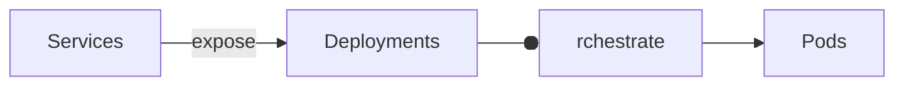

# Kubernetes
* https://kubernetes.io/docs/reference/kubectl/cheatsheet/
* https://kubernetes.io/docs/concepts/architecture/nodes/
* https://kubernetes.io/docs/concepts/workloads/pods/
* https://kubernetes.io/docs/concepts/workloads/controllers/replicaset/
* https://kubernetes.io/docs/concepts/workloads/controllers/deployment/
* https://kubernetes.io/docs/concepts/services-networking/service/

[Minikube](https://minikube.sigs.k8s.io/docs/start/) is a local kubernetes
instance with only one node (the machine it runs on).

    minikube version
    minikube start

Real kubernetes has many nodes (real or virtual machines) managed by the
control-master.  Each node runs kubelet (talks to control-master), and some
container runtime (eg. docker, containerd).

    kubectl version
    kubectl cluster-info
    kubectl get nodes

    kubectl create deployment kubernetes-bootcamp --image=gcr.io/google-samples-kubernetes-bootcamp:v1
    kubectl get deployments

Start a proxy to expose the pods:

    kubectl proxy
    curl http://localhost:8001/version
    curl http://localhost:8001/api/v1/namespaces/default/pods/$POD_NAME/proxy/

Troubleshooting with kubectl:

    kubectl get - list resources
    kubectl describe - show detailed information about a resource
    kubectl logs - print the logs from a container in a pod
    kubectl exec - execute a command on a container in a pod

Scriptable get pod names:

    kubectl get pods -o go-template --template '{{range.items}}{{.metadata.name}}{{"\n"}}{{end}}'

A kubernetes service is an application abstraction to access a group of pods (because pods may die).
Services match pods using labels and selectors.

Create a service by exposing a deployment, the find out the IP and curl it.

    kubectl expose deployment/kubernetes-bootcamp --type="NodePort" --port 8080
    export NODE_PORT=$(kubectl get services/kubernetes-bootcamp -o go-template='{{(index .spec.ports 0).nodePort}}')
    curl $(minikube ip):$NODE_PORT

Config:

    https://kubernetes.io/docs/concepts/cluster-administration/manage-deployment/
    https://kubernetes.io/docs/tasks/access-application-cluster/connecting-frontend-backend/

Resources are labelled, then selected:

